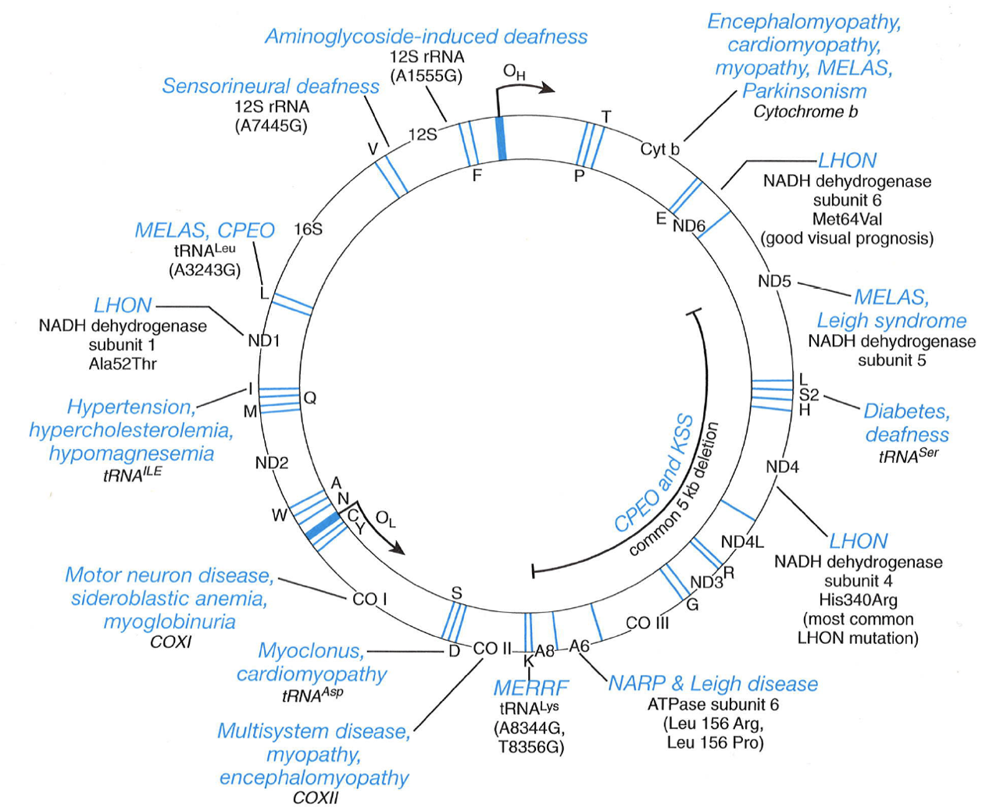

<!-- This is the readme for the STAT 235 midterm project -->

# A Descriptive Analysis of the Helix Mitochondrial Genome Mutation Database (HelixMTDdb)

*The goal of this assigment was to demonstrate several methods of categorical data analysis. We characterized the frequencies of mutations in different types of coding sequences in human mitochondrial DNA.*

## **Introduction**

Mitochondria are essential mediators of fat and carbohydrate metabolism in all eukaryotic organisms.  They are likely descended from a free-living bacterial ancestor that took up residence within a eukaryotic cell more than one billion years ago.  Reflecting this evolutionary history, mitochondria are enveloped in a double membrane, produce their own ribosomal RNA, and contain their own circular, bacterial-like genome (mtDNA) that encodes 13 proteins involved in the electron transport chain, 22 tRNAs, and 2 ribosomal RNAs (Figure 1).  Mutations in mtDNA are relatively common due mainly to their oxidizing environment and the 10-fold higher mutation rate of mitochondrial DNA polymerase compared to nuclear DNA polymerases.  Most variation in mtDNA sequences is confined to the non-coding control region, the D-loop, which mediates mtDNA replication, and has been used to infer maternal ancestry in humans, as all mtDNA is maternally inherited.  The number of mitochondria per cell body varies widely among tissues, with the highest numbers in oocytes, neurons, liver and muscle cells.  The number of mtDNA copies per mitochindrion varies per cell and mutations may arise independently within any one of them. Consequently, most cells contain an ensemble of mitochondria bearing distinct genomes, a condition known as heteroplasmy.  In the case of homoplasmy, the composition of mitochondria within a cell is uniform.  

### Figure 1. Human mtDNA

<figure>
  
  <figcaption>Boguszewska, K. et al.</figcaption>
</figure>

The incidence of mitochondrial disorders (Figure 2) is roughly 1 in 5000 and at least 1 in 200 people are carriers of potentially pathogenic mutations.  The penetrance of mitochondrial disorders is highly variable and depends on whether a mutation is homoplasmic or heteroplasmic.  In the latter case, a disease phenotype is believed to arise only when the fraction of mutant mitochondria within a cell exceeds some threshold, the value of which varies per allele.  

### Figure 2. Known disease causing mtDNA mutations

<figure>
  
  <figcaption>Nussbaum, R.L., McInnes, R.R., and Willard, H.F., 2007 <em>Thompson and Thompson Genetics in Medicine 7th ed.</em> Philadelphia: Saunders</figcaption>
</figure>

We obtained the HelixMTdb dataset of more than 4 million nucleotide polymorphisms in the mtDNA of over 195,000 individuals who voluntarily donated saliva samples to Helix for general genomics research.  We did not explore in detail whether specific mutations detected are likely to be pathogenic, as that would be beyond the scope of this assignment.  Instead, we focussed on whether genes and sequence features in mtDNA are equally likely to harbor mutations and whether distinct types of mutations are equally likely in all sequence features.  

## **Data Description**

Data are from an ongoing cross-sectional study, as neither explanatory, nor response variables are fixed and only the sample size is known.  The HelixMTDdb was downloaded from <https://www.helix.com/pages/mitochondrial-variant-database> on October 5, 2020.  The data base consists of alleles detected in over 195,000 subjects that differ from the Cambridge reference human mtDNA sequence (GenBank: J01415.2).  The variables that we selected for our analysis include:  

- **locus**: the map location in mtDNA of the variant detected.
- **alleles**: the base pair changes detected
- **feature**: the type of sequence (non-coding, protein, rRNA, or tRNA)
- **gene**: the gene in which the variant was detected
- **counts_hom**: the number of homoplasmic variants detected per locus  
- **counts_het**: the number of heteroplasmic variants detected per locus  

Additionally, we created variables to facilitate our analyses of mutation types.  Based on the alleles for each locus we categorized mutations as transitions (T ⟶ C, C ⟶ T, A ⟶ G, G ⟶ A), transversions (A ⟶ T, T ⟶ A, G ⟶ C, C ⟶ G), or in-dels (insertion - deletions) of various lengths by default after accounting for the previous types of point mutations.  

## **Results and Discussion** 
The majority of the mitochondrial genome codes for proteins.  Accordingly, most substitutions detected were observed in protein coding sequences, as they represent a larger target size for random mutations (Table 1).  

### **Table 1.** Proportions of sequence types and mutations within the human mitochondrial genome

|        | Non-coding | Protein | Ribosomal RNA | Transfer RNA | Total
---------|---------|--------------|------------|------------|-----
 **Length** | 1246 | 11,382 | 2511 | 1486 | 16,625
 **Proportion** | 7.49% | 68.46% | 15.10% | 8.94% | 100%
 **Homoplasmic** | 645,675 | 2,643,888 | 781,284 | 150,740 | 4,221,587
 **Heteroplasmic** | 24,697 | 32,036 | 5550 | 4272 | 66,525  

In general, the ranking of sequence types by number of mutations detected matches their ordering by overall length, indicating that each serves as a target for *randomly* distributed mutations.  Given that longer DNA sequences represent larger targets for random mutations, it makes little sense to compare absolute numbers of mutations between sequences of different lengths, as shorter sequences simply cannot accumulate as many mutations as longer sequences over the same time.  Thus, we normalized the total numbers of mutations detected per sequence type to the length of each type of sequence in the genome. Doing so clearly revealed how the rates of mutations detected for each type of sequence do not follow the ordering set by absolute sequence lengths (Table 3).  Substitutions were detected in non-coding sequences at a rate more than two-fold greater than that of protein coding sequences, regardless of plasmicity, even though non-coding sequences amount to one ninth of total protein coding sequence. Since the mutations detected represent mutations in mtDNA that are compatible with life, this suggests that mutations in non-coding sequences are less deleterious than mutations in protein coding sequence.  This pattern was also generally observed for nuclear DNA.  Of course, these findings make perfect sense in light of how evolution works, for only those mutations that do not interfere with life will be present among living individuals, and particular sequences that are essential for mitochondrial functions will dominate the distributions of all possible sequences over all genes.  

Homoplasmic variants were detected in all sequence types at a rate approximately 20-fold greater than heteroplasmic variants (Table 3 and Figures 3 and 4).  

### **Table 3.** Aggregated substitutions per base pair for each sequence type

|           | homoplasmic | heteroplasmic
------------|-------------|---------
 **non-coding** | 518.20          | 19.82
 **coding**     | 232.52          | 2.72
 **protein**    | 232.29          | 2.81
 **rRNA**       | 311.14          | 2.21
 **tRNA**       | 101.44          | 2.87

### Figure 3

### Figure 4

We first examined the association of plasmicity with sequence type by comparing combined numbers of variants detected for protein, rRNA, and tRNA sequences (coding sequences) vs. non-coding sequence (Table 4).  

### **Table 4.** Variants per bp by plasmicity and sequence type

|        | non-coding |         |   coding  |          |
---------|------------|----------|-----------|----------|
|        |   count    |     proportion   |   count   | proportion
|**homoplasmic**| 5129.66 |   0.47     |5821.35   | 0.53
**heteroplasmic**| 181.46 |   0.63     | 105.93 |   0.37    |

Fifty-three percent of homoplasmic substitutions occur in coding sequences.  In contrast, coding sequences accounted for only 37% of heteroplasmic substitutions.  The rates of substitutions among coding versus non-coding sequences for homoplasmic and heteroplasmic alleles are significantly different by Pearson's chi-squared test for equality of two sample proportions (Χ2 = 29.197, p-value = 6.54 x 10-08). The lowest expected substitution rate per base pair was 135.82, thus satisfying the requirement for ≥ 5 expected counts for the chi squared test.  Odds ratio tests also show a statistically significant difference in homoplasmy vs heteroplasmy for numbers of coding variants vs. non-coding variants.  For coding sequences vs. non-coding sequences the odds ratio for the rate of homoplasmic substitution is 1.944 (p-value = 5.71 x 10-08 by Fisher’s exact test; 95% Wald CI: 1.525 - 2.478).  Thus, alleles yielded by substitutions in coding sequences are more likely to be homoplasmic and significantly fewer heteroplasmic variants per base pair were detected in coding sequences than in non-coding sequences.  

Given that we may have lost some granularity in the data by combining the levels of coding sequences into one category, we performed a Pearson’s chi squared test of independence keeping coding sequences separated into protein, rRNA, and tRNA genes (Table 5).  

### **Table 5.** Plasmicity vs. individual sequence type

|            | non-coding | protein |  rRNA  |    tRNA     |
-------------|------------|---------|--------|-------------|
|**homoplasmic** |   5129.66  | 2869.23 |698.50  | 2253.62
**heteroplasmic**|   181.46   |   37.53 | 4.64   |   63.76     |

The lowest expected rate was 17.98, thus satisfying the requirement for ≥ 5 expected substitutions per base pair for all levels of sequence type vs. plasmicity for the chi squared test.  Plasmicity and sequence type are associated (Χ2 = 44.95, p-value = 9.48 x 10-10).  A log likelihood ratio test of independence also supports this conclusion (G = 51.76, p-value = 3.37 x 10-11).  An analysis of the chi squared residuals, demonstrates that observed and expected rate proportions differed little for homoplasmic variants across all sequence types (Table 6).  In contrast, considerably more heteroplasmic variants per base pair were observed in non-coding sequences than expected, while considerably fewer variants were observed in protein coding and ribosomal RNA sequences than expected.  These findings are consistent with protein and rRNA sequences being less tolerant of heteroplasmic substitutions than non-coding sequences (compare Figures 5 and 6).  

### **Table 6.** Chi squared residuals for plasmicity vs. individual sequence type

|            | non-coding | protein |  rRNA  |    tRNA     |
-------------|------------|---------|--------|-------------|
|**homoplasmic** |   -0.63    | 0.69    |  0.51  | -0.095
**heteroplasmic**|   3.92     |   -4.27 | -3.51  |   0.58     |

We examined the association between mutation type and plasmicity by pooling transitions and transversions as point mutations and comparing them to insertions and deletions (in-dels) (Table 7). 

### Figure 5

### Figure 6

### **Table 7.** Mutation type vs. plasmicity

|        | in-dels |         |   point mutations  |          |
---------|------------|----------|-----------|----------|
|        |   per bp rate    |     proportion   |   per bp rate   | proportion
|**homoplasmic**| 539.87 |   0.049     |10411.14   | 0.95
**heteroplasmic**| 102.35 |   0.36     | 184.98 |   0.64    |

Only 5% of the homoplasmic mutation rate was contributed by in-dels.  In contrast, 36% of heteroplasmic per base pair variation was due to in-dels, and 64% was due to point mutations.  A Pearson's chi-squared test for equality of two sample proportions demonstrates an association between plasmicity and mutation type (Χ2 = 483.8, p-value < 2.2 x 10-16). The lowest expected rate was 16.42, thus satisfying the requirement for ≥ 5 expected counts for the chi squared test.  The data suggest that mutations are more likely to be caused by point mutations than in-dels regardless of plasmicity (odds ratio 10.67, p-value = 3.37 x 10-55 by Fisher’s exact test; 95% Wald CI: 8.256246 - 13.78992).  Additionally, in-dels are associated with heteroplasmic substitutions more than with homoplasmic substitutions. 

Most mutations detected in mtDNA were transitions (Figure 7).  We wondered if we were obscuring the data by pooling transitions and transversions into a single point mutation category, so we split the data into three categories (Table 8). 

### Figure 7

### **Table 8.** Plasmicity vs. individual mutation type

|            | in-dels | transitions |  tranversions |
-------------|---------|-------------|---------------|
|**homoplasmic** |  539.87 |   9797.70   |    613.44     |
**heteroplasmic**|  102.35 |   175.99    |    8.99       |

A Pearson’s chi squared test of independence on the uncombined data yielded a similar statistic to the binned data (Χ2 = 489.72, p-value < 2.2e-16).  By likelihood ratio G-test, we also conclude that mutation type and plasmicity are associated (G = 246.89, p-value < 2.2e-16).  Examination of the chi squared residuals (Table 9, next page) shows that more heteroplasmic in-dels were observed than expected but considerably fewer homoplasmic in-dels were observed.  Considerably fewer heteroplasmic transitions were also observed than expected. 

### **Table 9.** Chi squared residuals for plasmicity vs. individual mutation type

|            | in-dels | transitions |  transversions  |
-------------|---------|-------------|-----------------|
|**homoplasmic** |   -3.43 |    0.80     |      0.28       |
**heteroplasmic**|   21.21 |   -4.95     |     -1.73       |

Most mutations detected in non-coding sequences consisted of in-dels, while transitions and transversions were far more likely to be found in coding sequences (Figure 8).  

### Figure 8

This suggests that non-coding sequences are more tolerant of potentially more damaging mutations.  The rate at which in-dels were detected in protein coding sequence was only 2.14 substitutions per base pair, in contrast to 600.83 substitutions per base pair in non-coding sequence (Table 10).  

### **Table 10.** Substitution rate by mutation type and sequence feature

|            | non-coding | protein |  rRNA  |    tRNA     |
-------------|------------|---------|--------|-------------|
|   **in-del**   |   600.83   |  2.14   |  4.22  |    35.03    |
  **transition** |   4201.98  |  2817   | 692.53 |   2262.18   |
**transversion** |   508.31   |  87.60  |  6.40  |    20.12    |

Substitution rates differed greatly between transitions and transversions for all sequence types, consistent with transversions being much less tolerated in mtDNA than transitions. A Pearson’s chi squared test implies these differences are significant and that mutation type and feature are not independent (Χ2 = 970.18, p-value < 2.2 x 10-16).  The least expected rate was 40.18, thus satisfying the requirement of ≥ 5 expected counts for the chi squared test.  Analysis of the residuals demonstrates that for in-dels, a far lower rate was observed than expected in coding sequences while a far higher rate was observed than expected in non-coding sequences (Table 11).  Essentially the same was true of transversions, but not for transitions, which show an opposite trend. Transitions were less common in non-coding sequences than expected, but slightly more common in protein sequences than expected. These findings suggest that transitions and transversions should not have been lumped into a common “point mutation” category and that protein coding sequences preferentially accumulate transitions versus transversions. 

### **Table 11.** Chi squared residuals for mutation rate by mutation type and sequence feature

|            | non-coding | protein |  rRNA  |    tRNA     |
-------------|------------|---------|--------|-------------|
|   **in-del**   |    17.07   |  -12.72 | -5.67  |    -8.46    |
  **transition** |    -7.45   |   4.67  |  2.74  |     4.53    |
**transversion** |    12.49   |  -5.78  | -5.21  |    -9.55    |

These data also suggest that a sizable proportion of *possible* in-dels and transversions are essentially missing from the human population assessed by Helix, probably because such mutations are incompatible with life.

## **Conclusion** - A three-way interaction

The main advantage of the HelixMTDdb over other sources, such as the MitoMap database, is that none of the study subjects were recruited specifically because they had a mitochondrial disease.  Thus, the Helix data are more representative of the general population.  Although, these data are drawn from a population where people of Asian and African descent are underrepresented, our findings are likely broadly applicable to the entire human population.

Plasmicity, mutation type, and sequence type do not pair-wise independently determine the rate at which mutations are detected in mtDNA.  Of the three models for the interaction of three variables, we concentrated on the model of conditional independence, where we examine the association of two of the variables at each level of the third variable.  Given the distinction between homoplasmic and heteroplasmic mutations, we first examined the association of mutation type and sequence type at each level of plasmicity.  A likelihood ratio G test of conditional independence does not support that mutation type and sequence type are both independent of plasmicity (G = 1124.99, p-value = 2.44 z 10233).  Next we examined the association of plasmicity and mutation type at each level of sequence type. Again, we did not obtain evidence of a conditional independence of both plasmicity and mutation type with sequence type (G = 224.3, p-value = 4.75 x 10-44).  The smallest test statistic was obtained when controlling for protein in the examination of mutation type vs. plasmicity (G = 2.14, df = 2, p-value = 0.34).  Thus, for proteins, plasmicity and mutation type are independent. Finally, we tested the conditional independence of plasmicity and sequence type on mutation type and also found no evidence that they are independent conditioning on mutation type (G = 29.14  p-value = 0.0006).

Altogether, our analysis reveals that sequence type, mutation type, and plasmicity are all associated with each other, with the exception of the independence of mutation type and plasmicity for protein coding sequences. This may be true because protein coding sequences were mostly affected by transitions and transversions, and rarely by in-dels, which are more likely to be heteroplasmic, whereas transitions and transversions are more equally likely to be heteroplasmic or homoplasmic.  In-dels are highly disruptive to protein structure and often lead to frame shifts or protein truncation due to premature translation termination.  This explains why in-dels were most prevalent in non-coding sequences. Alleles able to reach homoplasmy are less likely to be deleterious, whereas more deleterious alleles found in a living person would have to be heteroplasmic and thus co-exist with a considerable proportion of wild-type mtDNA.  The fact that far fewer heteroplasmic alleles per base pair were found for all coding sequences demonstrates their propensity to be more harmful than homoplasmic alleles.

## **References**
Selective constraints and pathogenicity of mitochondrial DNA variants inferred from a novel database of 196,554 unrelated individuals, Bolze and Mendez et. al., *BioRxiv*, October 8, 2019.

The similarities between human mitochondria and bacteria in the context of structure, genome, and base excision repair system. Boguszewska, K., Szewczuk, M., Kazmierczak-Baranska, J., and Karwoski, B. *Molecules* 2020, **25**, 2857; doi:10.3390/molecules25122857

Nussbaum, R.L., McInnes, R.R., and Willard, H.F., 2007 *Thompson and Thompson Genetics in Medicine 7th ed.* Philadelphia: Saunders

